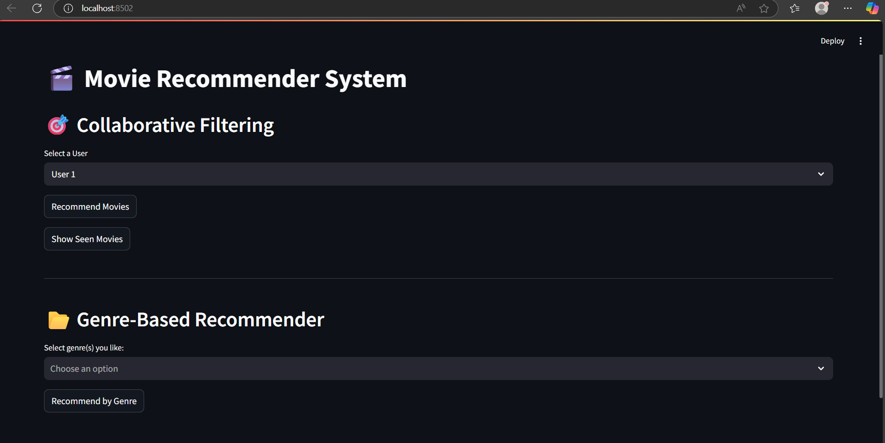

# 🎬 Movie Recommendation App

A simple yet effective movie recommendation system built using **Python**, **Pandas**, and **Streamlit**.  
It allows users to select movie genres and receive top-rated recommendations, enriched with IMDb ratings and links.

---

##  Preview



---

## Live Demo

<!-- Replace this link with your real deployed link once available -->
*Coming soon on Streamlit Cloud*

---

## Features

- Filter top movies based on selected genre
- Calculate and display average user ratings
- Show IMDb scores and provide direct links
- Interactive and clean UI built with Streamlit
-  Modular and organized code structure for easy development

---

##  Tools & Libraries Used

- `Python`
- `Pandas`
- `Streamlit`
- `Git`
- `scikit-learn`
- `pytest` *(optional, for testing purposes)*

---

## Recommendation Methods

- **Collaborative Filtering**: Recommends movies based on similar users’ preferences  
- **Genre-Based Filtering**: Allows selection of genres to get top-rated recommendations using cosine similarity

---

##  How to Run the Project Locally

```bash
# Clone the repository
git clone https://github.com/Syntax-Vibe/movie-recommender.git

# Navigate to project directory
cd movie-recommender

# Install dependencies
pip install -r requirements.txt

# Run the Streamlit app
streamlit run app/app.py


🧑‍💻 Author
Syntax-Vibe (Amir)
GitHub: https://github.com/Syntax-Vibe

